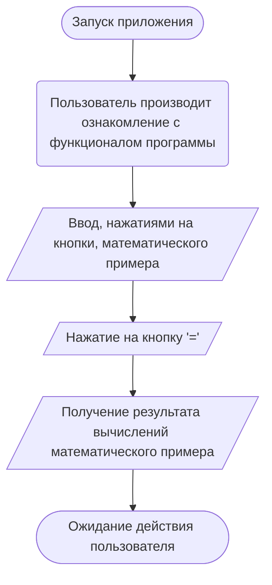

# Application-11-14
Разработка оконного приложения «Калькулятор»

## Аннотация
**Цель проекта:** Создание и разработка оконного приложения «Калькулятор»

**Средства реализации (Метод, подход и/или алгоритм):** Подходы к разработке оконных приложений на языке программирования C++

**В какой области проект может быть полезен/применим:** Оконное приложение «Калькулятор» может пригодиться в области точных наук, классических вычислений.

**Какую проблему решает проект:** Оконное приложение «Калькулятор» помогает экономить время и экономить время, давать точные расчёты и никогда не ошибаться. 

## Алгоритм работы

## Схема работы
Что это такое?

## Руководство пользователя
Что это такое?

## Тестирование программы и журнал испытаний
| № | Действие пользователя | Ожидаемый результат | Реальный результат | Комментарий |
|:---:|:---:|:---:|:---:|:---:|
| 1 | Открытие приложения | Успешное открытие | Успешно | Никаких ошибок |
| 2 | Нажатие кнопки "ОК" | Успешное закрытие приложения | Успешно | Никаких ошибок |
