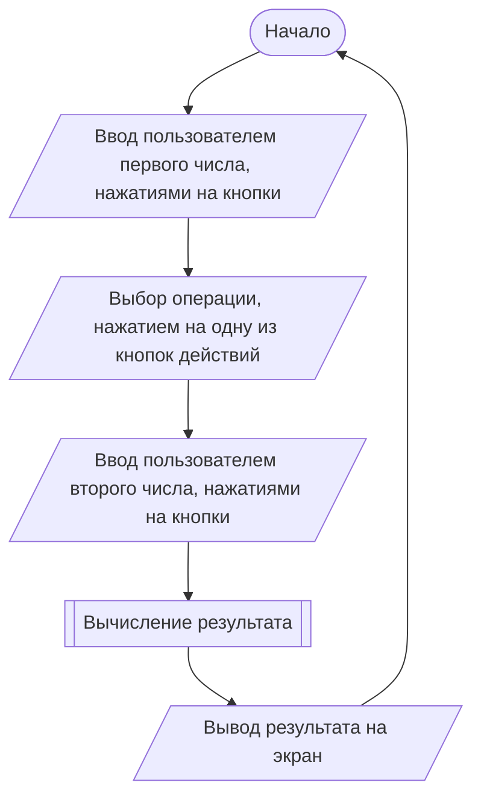
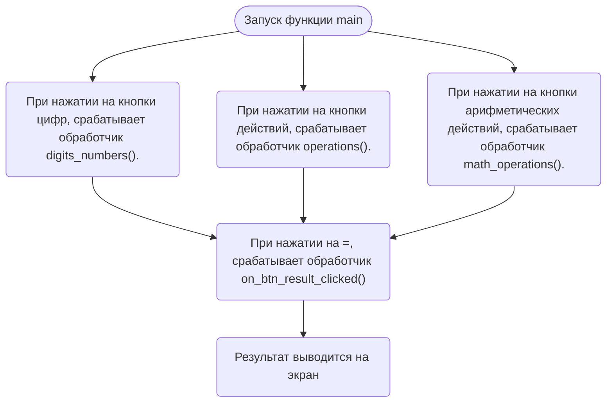

# Application-11-14
Разработка оконного приложения «Калькулятор»

## Аннотация
**Цель проекта:** Создание и разработка оконного приложения «Калькулятор»

**Средства реализации (Метод, подход и/или алгоритм):** Подходы к разработке оконных приложений на языке программирования C++

**В какой области проект может быть полезен/применим:** Оконное приложение «Калькулятор» может помочь в решении простых арифметических действий.

**Какую проблему решает проект:** Оконное приложение «Калькулятор» помогает экономить время и экономить время, давать точные расчёты и никогда не ошибаться. 

## Алгоритм работы

## Схема работы

## Руководство пользователя
При запуске программы на экран выводится окно программы, содержащее кнопки 1,2,3,4,5,6,7,8,9,0,.,/,*,+,-,C,SQRT,%

При нажатии на кнопку-цифру программа начнёт свою работу, то есть в окне программы на "дисплее" результатов появится набранная цифра.

Для вычисления какого-либо математического примера необходимо сначала ввести число, а после этого нажать на кнопку необходимого арифметического действия.

Для вычисления квадратного корня, нужно ввести число и нажать кнопку "SQRT".

Для вычисления результата нужно нажать кнопку "=", а для сброса результата нужно второй раз нажать "C".

## Тестирование программы и журнал испытаний
| № | Действие пользователя | Ожидаемый результат | Реальный результат | Комментарий |
|:---:|:---:|:---:|:---:|:---:|
| 1 | Открытие приложения | Успешное открытие | Успешное открытие | Никаких ошибок |
| 2 | Ввод второго числа равное нулю при делении | Ошибка | Вывод ошибки | Делить на ноль нельзя |
| 3 | Взять корень квадратный от отрицательного числа | Ошибка | Вывод ошибки | Калькулятор не работает с комплексными числами |
